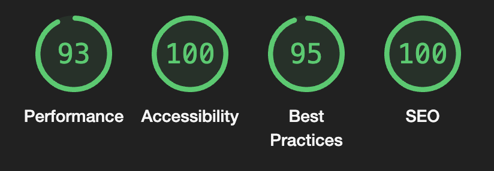

*<a href="https://github-blog-blue.vercel.app">
  
  <h1 align="center">GitHub Blog</h1>
</a>

<p align="center">
   A dynamic, Notion-style WYSIWYG editor that innovatively utilizes GitHub Issues as its backend database.
</p>

<p align="center">
  <a href="#introduction"><strong>Introduction</strong></a> ·
  <a href="#demo"><strong>Demo</strong></a> ·
  <a href="#project-structure"><strong>Project Structure</strong></a> ·
  <a href="#features"><strong>Features</strong></a> ·
  <a href="#playground"><strong>Playground</strong></a> ·
  <a href="#installation"><strong>Installation</strong></a> ·
  <a href="#deploy-your-own"><strong>Deploy Your Own</strong></a> ·
  <a href="#tech-stack"><strong>Tech Stack</strong></a> ·
  <a href="#references"><strong>References</strong></a>
</p>
<br/>

## Introduction

[GitHub Blog](https://github-blog-blue.vercel.app) is a dynamic, Notion-style WYSIWYG editor that innovatively utilizes GitHub Issues as its backend database.

See <a href="#installation"><strong>Installation</strong></a> to get started right away.

## Demo
[GitHub Blog](https://github-blog-blue.vercel.app/posts/1)

[Guide for using this app](https://github-blog-blue.vercel.app/posts/24)
## Project Structure 
1. This project was built on top of [Novel](https://novel.sh/), on top of Next.js App router, also a Turbo repository template, which gives scalability and flexibility to the project.
2. File structure:
```
.
├── app
│   ├── (v1)
│   │   ├── edit
│   │   │   └── [id]
│   │   │       ├── layout.tsx
│   │   │       ├── loading.tsx
│   │   │       └── page.tsx
│   │   └── posts
│   │       └── [id]
│   │           ├── layout.tsx
│   │           ├── loading.tsx
│   │           └── page.tsx
│   ├── (v2)
│   │   ├── [owner]
│   │   │   ├── [repo]
│   │   │   │   ├── edit
│   │   │   │   │   └── [id]
│   │   │   │   │       ├── layout.tsx
│   │   │   │   │       ├── loading.tsx
│   │   │   │   │       └── page.tsx
│   │   │   │   ├── page.tsx
│   │   │   │   └── posts
│   │   │   │       └── [id]
│   │   │   │           ├── layout.tsx
│   │   │   │           ├── loading.tsx
│   │   │   │           └── page.tsx
│   │   │   ├── loading.tsx
│   │   │   └── page.tsx
│   │   └── loading.tsx
│   ├── api
│   │   ├── auth
│   │   │   └── [...nextauth]
│   │   │       └── route.ts
│   │   ├── generate
│   │   │   └── route.ts
│   │   ├── revalidate
│   │   │   └── route.ts
│   │   └── upload
│   │       └── route.ts
│   ├── error.tsx
│   ├── favicon.ico
│   ├── global-error.tsx
│   ├── layout.tsx
│   ├── loading.tsx
│   ├── opengraph-image.jpeg
│   ├── page.tsx
│   ├── providers.tsx
│   ├── robots.ts
│   ├── type.d.ts
│   └── visualizer
│       └── page.tsx
├── components
│   ├── <custom-component>.tsx
│   └── ui
│       ├── <ui-component>.tsx
├── components.json
├── lib
│   ├── auth.ts
│   ├── contexts
│   │   └── AuthContext.tsx
│   ├── converter.ts
│   ├── extensions.ts
│   ├── github-issues-api.ts
│   ├── hooks
│   │   ├── <hook>.ts
│   ├── selectors
│   │   ├── <selector>.tsx
│   ├── suggestions.tsx
│   └── utils.ts
├── next-env.d.ts
├── next.config.js
├── package.json
├── postcss.config.js
├── prettier.config.js
├── styles
│   ├── CalSans-SemiBold.otf
│   ├── fonts.ts
│   ├── globals.css
│   └── prosemirror.css
├── tailwind.config.ts
└── tsconfig.json

29 directories, 88 files
```
- v1: Self-hosted blog
  - `/`: The home page, listing all the blog posts.
  - `/edit/[id]`: The editor page for the blog post.
  - `/posts/[id]`: The published blog post page.
- v2: Platform blog
  - `/[owner]`: The home page, listing all the repos of the owner.
  - `/[owner]/[repo]`: The home page, listing all the blog posts.
  - `/[owner]/[repo]/edit/[id]`: The editor page for the blog post.
  - `/[owner]/[repo]/posts/[id]`: The published blog post page.

3. The app is divided into two versions, v1 and v2. The v1 is the self-host version, and the v2 is the platform version, which can be used to host multiple blogs for multiple users and repos.
4. The app is using GitHub Issues as the backend database, and GitHub OAuth for authentication.
5. The content of the blogs will be fetched in the server components and pass to the client components for rendering. Also, utilizing the React Suspense feature. This is to improve SEO and UX.
6. Requirements:
- [x] GitHub OAuth Login
- [x] Post Management
- [x] User Interface - Pagination
- [x] User Interface - Post Editor - Markdown and CRUD operations
- [x] User Interface - Form Validation
- [x] Hosting - Vercel: https://github-blog-blue.vercel.app
- [x] Lighthouse

*Caption: LightHouse report (Remaining score are from packages)*

1. You can check out the App Router Tree Visulizer at `http://localhost:3000/visualizer` to see the router tree of the app.

## Playground
Explore the application here: [GitHub Blog](https://github-blog-blue.vercel.app). This project introduces an innovative way to manage blog content using GitHub repositories, offering two distinct modes of operation: a self-hosted blog and a platform blog. See the ***Guide*** Post for more information.

- Self-Hosted Blog: Configured via the `.env` file using `GITHUB_REPO` and `GITHUB_OWNER`, this mode personalizes the blog to your specific GitHub repository. It's designed for individual users who prefer a dedicated space for their content.

- Platform Blog: By specifying the repository details in the URL, like https://github-blog-blue.vercel.app/YouMingYeh/github-blog, the platform blog mode allows for dynamic content sourcing directly from any GitHub repository. This flexibility is perfect for showcasing various projects or collaborating across different repositories.

Visiting https://github-blog-blue.vercel.app displays the content from the YouMingYeh/github-blog repository, mirroring the production environment setup. Alternatively, navigating to https://github-blog-blue.vercel.app/YouMingYeh/github-blog accesses the same repository content through the platform blog mode, with an easy-to-use interface for exploring or switching between repositories.

While you have the option to streamline the application by removing the unused version, retaining both provides a comprehensive understanding and flexibility in managing and displaying content. The dual functionality caters to a wide range of use cases, from personal blogging to showcasing projects or documentation in a collaborative setting.

## Features
1. **WYSIWYG Editor**: A Notion-style WYSIWYG editor that allows you to write and edit content.
2. **GitHub Issues as Database**: Utilizes GitHub Issues API as its backend database.
3. **SEO Enhancement**: Use server-side rendering to improve SEO. See [My Implementation](https://github.com/YouMingYeh/github-blog/tree/main/apps/web/app/posts/%5Bid%5D) with Next.js.
4. **GitHub App**: Use GitHub App with OAuth to authenticate users.
5. **Infinite Scrolling with Pagination**: Use GitHub Issues API to implement infinite scrolling with pagination.


## Installation


To use GitHub Blog in a project, you can run the following command to install it.

```
git clone http://github.com/YouMingYeh/github-blog
```
Then, you will need to fill in the environment variables in `.env.example` and rename it to `.env`.

**Note**: You will need to create a GitHub OAuth App. You can follow the instructions [here](https://docs.github.com/en/developers/apps/building-oauth-apps/creating-an-oauth-app) to create a GitHub App (OAuth App). Also, you will need to grab the `GITHUB_CLIENT_ID`, `GITHUB_CLIENT_SECRET`, from the GitHub App you created.

Afterwards, you can run the following commands to start the app.

```
cd github-blog
pnpm install
pnpm run dev
```

Note that you will need to have [Node.js](https://nodejs.org/en/) and [pnpm](https://pnpm.io/) installed on your machine.


Here's an example application: https://github-blog-blue.vercel.app

## Deploy Your Own
Make sure you have fill in the environment variables in `.env.example` and rename it to `.env`.

**Note**: You will need to configure the GitHub App's `Homepage URL` and `Callback URL` to your deployment URL.

## Tech Stack

This app is built on the following stack:

- [Next.js](https://nextjs.org/) – framework
- [Tiptap](https://tiptap.dev/) – text editor
- [Novel](https://novel.sh/) - Template
- [Vercel](https://vercel.com) – deployments
- [TailwindCSS](https://tailwindcss.com/) – styles
- [pnpm](https://pnpm.io/) – package manager
- [TypeScript](https://www.typescriptlang.org/) – language
- [GitHub API](https://docs.github.com/en/rest) – backend
- [GitHub OAuth](https://docs.github.com/en/developers/apps/building-oauth-apps) – authentication
- [GitHub Issues](https://docs.github.com/en/issues) – database
- [Shadcn/ui](https://ui.shadcn.com/) – components

## References
Special thanks to [Novel](https://novel.sh/) for the template for the nice editor.
*# golang-blog
